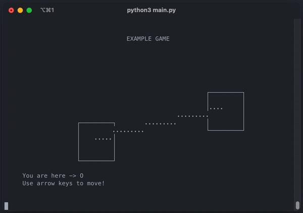

# Gasciime

**Gasciime** (/ɡæs kɪm/) is an ASCII Python game engine for building terminal based games. It is inspired by the LÖVE Lua game engine.

<p align="center"></p>

## Features

- [x] Dynamic window size (and resize) detection
- [x] Customizable FPS value
- [x] Basic drawing methods (point, line, rectangle, ellipsis, circle and text)
- [x] Keyboard input handling and events
- [x] Use the terminal's alternate screen

> Note: Gasciime uses the [curses](https://docs.python.org/3/library/curses.html) module for its backend.

## Installation

```bash
$ git clone git@github.com:0lbap/gasciime.git
$ cd gasciime
$ python3 -m venv venv
$ . venv/bin/activate
$ pip install -r requirements.txt
```

## How to use

You can begin writing your own game by extending the `Game` class. Then, you will need to create an instance of your game and call the `run()` method on it. Here is a basic example to quickly get you started :

```py
from gasciime import Game
import curses

class MyGame(Game):
  def load(self):
    self.player_x = 20
    self.player_y = 10

  def on_key_press(self, key):
    if key == curses.KEY_UP:
      self.player_y -= 1
    elif key == curses.KEY_DOWN:
      self.player_y += 1
    if key == curses.KEY_LEFT:
      self.player_x -= 1
    elif key == curses.KEY_RIGHT:
      self.player_x += 1
    if key == ord("q"):
      self.stop()

  def draw(self):
    super().draw_point(self.player_x, self.player_y, "O")

game = MyGame()
game.run()
```

In this example, we overload three methods: `load()`, `on_key_press()` and `draw()`.

- First, in the `load()` method, we define two attributes `player_x()` and `player_y()`. This part will only run once, at the beginning of the game execution.
- Then, in the `on_key_press()` method, we check for which key is pressed and we change the player's coordinates accordingly. We also call `stop()` when pressing "q" to quit the game.
- Finally, in the `draw()` method, we draw the "O" character - our player's sprite - at coordinates (`player_x`, `player_y`) by calling the `draw_point()` method.

## Running the game

You can run your game with this simple command:

```bash
$ python3 main.py
```
